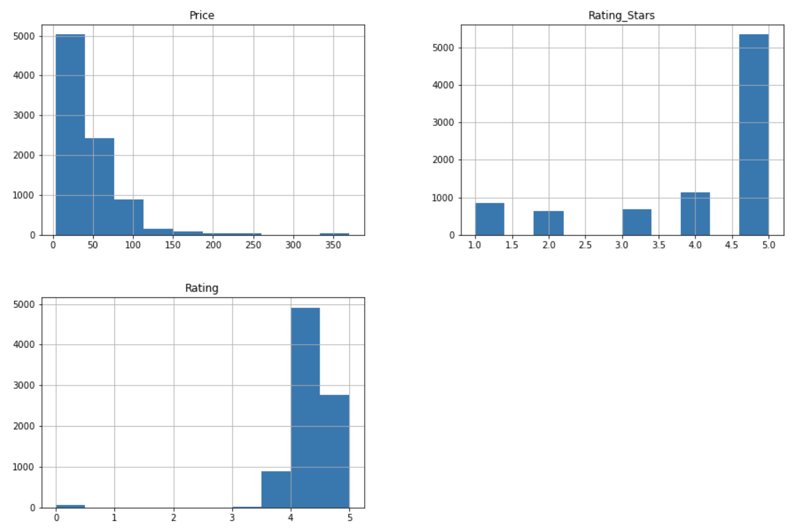

# Skincare Recommender
Author: Tosca Le


###### image source: istockphoto.com

## Overview
This project explores a dataset of specific types of skincare products from Sephora to build a recommendation system for customers looking to find different products and develop a skincare routine suited for their needs. Through the implementation of different collaborative filtering approaches, personalized recommendations can be obtained for individual customers.   
***

## Business Problem
As one of largest cosmetics retailer, Sephora is hoping to find new ways to attract and interact with customers who might find skincare and the number of products out there overwhelming. More specifically, help new customers filter and find products suited for their needs. Building recommendations tailored to customers' preferences will help not only their shopping experiences, but hopefully improve the likelihood of finding beneficial products.
***

## Data & EDA
Credits to Anastasia Gorina for the dataset and can be found [here](https://github.com/agorina91/final_project/blob/master/Jupyter_Notebook_and_CSV/skindataall.csv). The resulting dataset contains over 8000 entries of user reviews/ratings and product data. Below are distributions of the price of products, average product ratings, and user ratings in the dataset. Additional EDA of other features can be found in the [Jupyter Notebook](./skincare_recommender_notebook.ipynb) of this repo. 



***

## Methods
Through the different approaches of collaborative filtering, iterations of memory-based and model-based techniques are examined through similarity metrics and RMSE. Algorithms explored include: KNN Basic, KNN with Means, KNN Baseline, SVD and ALS. The dataset was split into training and test sets for model validation.
***

## Results
The KNN Baseline method with pearson correlation as the similarity metric had the lowest RMSE (1.17) with a mean test RMSE of 1.19 after cross-validation. SVD had a very similar RMSE after performing a grid search to tune hyperparameters.
***

## Conclusions
After determining the best model, recommendations were built out utilizing a function that takes in inputs, such as skin type, incorporates new customer ratings and then calculates similarities based on item-similarity to return the top N recommendations. An example of the complete output can be seen below with more explanation in the Jupyter Notebook of this repo. 


***

## Next Steps
- Obtain more data on different products and customers from Sephora improve and scale the recommendation system.
- Include different categories of skincare in future iterations to allow a diverse set of products that may be desired from customers.
- Explore the different approaches/models since a different technique may be more suitable depending on the needs of Sephora and how the data may change.
- Explore different ways to recommend products, such as looking at ingredients.
- Finish building out the web app for model deployment and for customers to interact with the recommendations.
***

### For More Information
Please review my full analysis in my [Jupyter Notebook](./skincare_recommender_notebook.ipynb) or [presentation](./skincare_recommender_presentation.pdf).

The dataset used in this analysis can be found [here](https://github.com/agorina91/final_project/blob/master/Jupyter_Notebook_and_CSV/skindataall.csv).

For any additional questions, please contact me at **toscatle@gmail.com**.
***

### Repository Structure
```
├── images
├── scr
├── static
├── .gitignore
├── LICENSE                          
├── README.md 
├── skincare_recommender_notebook.ipynb                                
└── skincare_recommender_presentation.pdf                             
```
